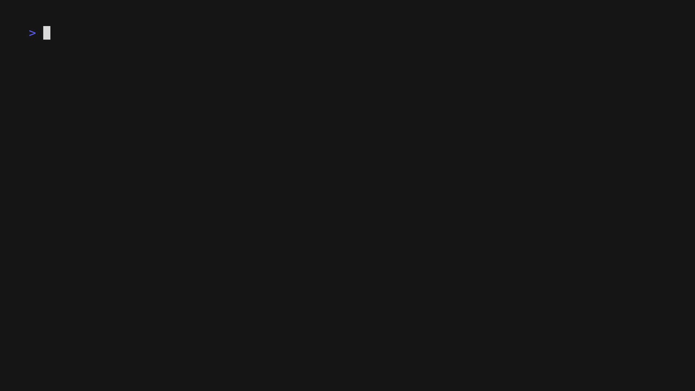

# hal
 
**HAL** is a graph-based modal shell and text editor using natural language.

## Installation

```console
$ go install github.com/picatz/hal
```

## Usage



> **Note**: the status bar is not properly displayed in the demo gif for some reason.